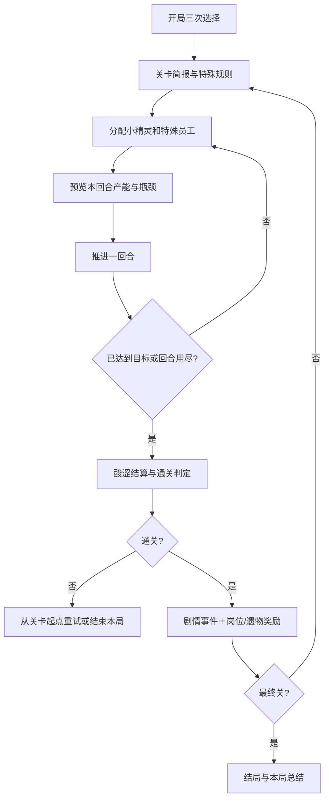

# 《赣什么·熬汤记》游戏策划案

> 文档版本：v0.9（制作基线稿）  
> 更新日期：2026-08-15  
> 项目版本：Unity 2022.3.12f1  
> 适用对象：策划、程序、美术、音频与测试  
> 资料来源：`Assets/Docs/“赣什么”游戏.xlsx`、`Assets/Docs/美术素材`、当前 `Assets/Scripts` 与 ScriptableObject 数据结构

## 0. 文档目的与内容边界

本稿将现有的“采集—处理—烹饪—风味结算”原型扩展为一套能够从开局、连续闯关到结局演出的完整游戏方案。文稿优先沿用已有系统、数值表和美术方向，并补齐世界观、主线剧情、关卡机制、通关条件、失败处理、局间奖励和制作验收标准。

为避免把构想误认为已完成内容，本文使用以下状态标记：

- **[已有]**：当前代码、Excel 或成品素材中已经存在。
- **[接入]**：底层能力已有，但还需要放进正式流程或补齐资源。
- **[新增]**：本稿提出的新内容，需要后续制作。
- **[远期]**：不阻塞首个可玩版本，可在完整版本中实现。

本文的核心定稿如下：

1. 游戏定位为单机 2D 回合制经营 Roguelite，单局由 7 个连续关卡构成，预计 60～90 分钟。
2. 玩家是“锅长”，通过分配小精灵与特殊员工，让食材依次经过采集、处理和烹饪，最终在回合限制内完成供汤目标。
3. 前 3 关沿用现有“巨人的早餐—午后宴席—巨人的晚宴”，既是首个三关 DEMO，也是完整剧情的第一幕。
4. 所有关卡的基础硬通关条件统一为“限定回合内累计达到目标分”；支线挑战负责提供星级、图鉴和外观，不阻塞主线。
5. 最终关在分数条件之外增加“四味归釜”仪式，构成完整通关，而不是单纯堆高分。
6. 视觉基调定为“高饱和糖果色的轻黑色童话”：可爱姜饼小精灵做着荒诞、偶尔残酷的工作，笑点与危险并存。

---

## 1. 产品定位

### 1.1 基本信息

| 项目 | 定义 |
| --- | --- |
| 暂定名称 | 《赣什么·熬汤记》 |
| 类型 | 2D、回合制、岗位分配、资源流水线、轻度 Roguelite |
| 平台 | PC；首版以鼠标操作为主 |
| 视角 | 单屏横向工作地图＋面板式管理界面 |
| 单局长度 | 三关 DEMO 约 20～30 分钟；完整七关约 60～90 分钟 |
| 核心受众 | 喜欢《背包英雄》《幸运房东》式构筑，以及轻量自动生产、资源规划的玩家 |
| 核心体验 | “用有限的小精灵，把一堆奇怪生物稳定地熬成一锅能救世界的汤” |

### 1.2 四项设计支柱

1. **岗位分配有取舍**：同一批员工不能同时负责采集、处理和烹饪，任何一段缺人都会形成瓶颈。
2. **风味改变结算时机**：热辣追求当回合爆发，寒冷能跳过普通烹饪，酸涩押注关底，鲜美放大已经建立的产能。
3. **事件让构筑带代价**：强力选项通常会消耗小精灵、仓库或未来效率，玩家需要判断“这锅汤值不值得”。
4. **世界会回应玩家的汤**：新食材、员工、遗物和剧情不是独立菜单，而是沿着主线地区和玩家选择逐步进入生产链。

### 1.3 不做什么

- 首版不做自由移动、即时战斗、复杂烹饪配方或大量手动小游戏。
- 食材不逐个放入锅中，玩家的主要操作是分配劳动力、选择岗位/升级/事件和决定何时推进回合。
- 角色养成以“员工类型＋遗物＋岗位进阶”为主，不做单个小精灵的装备、等级与复杂属性。
- 失败不依赖永久数值碾压；局外内容以解锁图鉴、事件和新开局池为主。

---

## 2. 世界观与剧情

### 2.1 世界背景：落釜大陆与赣地

落釜大陆的中心埋着一口比山还大的古代魔法锅——**世界之釜**。传说第一批小精灵用四种原初风味熬出“釜心汤”，才让寒潮退去、土地长出食材、巨人从石头中醒来。

世界之釜并不直接燃烧木柴。它以众生的食欲、记忆和劳动为火：

- **热辣**代表行动与欲望；
- **酸涩**代表时间、记忆与发酵；
- **寒冷**代表秩序、保存与凝结；
- **鲜美**代表生命之间的联系，也是最接近原始魔法的风味。

故事发生在大陆南部的**赣地**。这里土地肥沃、怪物众多，万物都可能成为汤料。赣地与北方巨人城签有“供汤契约”：小精灵负责熬汤，巨人负责压住世界之釜的锅盖，双方缺一不可。

某一天，一层没有味道的灰雾从锅底渗出。灰雾会吞掉饱腹感，使巨人越吃越饿，使食材失去风味，也让世界之釜开始干烧。这种灾害被称为**饥雾**。

### 2.2 玩家身份

玩家扮演新任**锅长**。上一任锅长在检查锅底时失踪，只留下一本写满潦草配方的工作日志。玩家继承 10 只姜饼般的小精灵、一间快要长满苔藓的仓库，以及一份巨人早餐订单。

玩家没有固定台词和外貌，选择即是性格：可以珍惜每一只小精灵，也可以用“残酷的美味”换取更高分；可以依赖素食和纯正风味，也可以把怪物、幽灵甚至异世界勇者塞进生产体系。

### 2.3 主要角色与势力

| 角色/势力 | 叙事作用 | 游戏对应 |
| --- | --- | --- |
| 锅长 | 玩家化身，负责排班、取舍与最终仪式 | 全部决策 |
| 姜饼小精灵 | 赣地的基础劳动力；可爱、嘴碎、很容易闯祸 | 基础员工，效率 1.0 |
| 族长 | 教程引导与事件旁白；总在危机发生后才拿出规章 | 教程、事件、局间结算 |
| 饥肠王·咕隆 | 巨人城的代表；前期像贪吃甲方，后期成为压住锅盖的盟友 | 前三关委托人 |
| 盐矿兄弟 | 将风味变成遗物构筑的商人 | “复合香盐”“纯正香盐”事件 |
| 蘑菇群落 | 既是食材，也是会把员工同化成蘑菇人的生态意识 | 蘑菇进阶、孢子事件 |
| 墓穴幽灵 | 被上一轮世界之釜遗忘的厨工 | 幽灵员工、死灵构筑 |
| 异世界勇者 | 以为自己要讨伐魔王，最后发现救世方式是做汤 | 高效率员工或探险遗物 |
| 吱吱 | 袭击厨房的怪兽，抓住后会吃掉部分处理产物 | 处理专属员工 |
| 饥雾 | 无人格的最终灾害；它不是被打败，而是被重新调味 | 关卡规则与最终仪式 |

### 2.4 剧情结构

#### 序章：第一张订单

巨人城送来早餐订单。族长宣布上一任锅长“只是暂时出差”，把锅铲交给玩家。第一关表面是一次普通供餐，结尾却出现一件异常：巨人吃完后仍然喊饿，碗底没有留下任何味道。

#### 第一幕：巨人三餐（第 1～3 关）

玩家从早餐、午宴做到晚宴，逐步掌握三种原料、三类处理岗位、三档火力和四种风味。神秘墓穴、企鹅式怪客和小精灵落锅等事件表明，世界的规则正在松动。第三关结束，饥肠王主动掀开城堡地板，露出连接世界之釜的裂缝：饥饿来自锅底，不来自胃。

#### 第二幕：寻找四味（第 4～5 关）

玩家进入雾菌沼泽和霜河渡口，寻找能让釜心汤重新拥有“生命联系”的四味原料。蘑菇群落希望借饥雾扩张，寒湖则正在冻结世界之釜的水脉。玩家开始接触蘑菇人、幽灵、勇者等特殊员工，也会面对更明显的牺牲与效率选择。

#### 第三幕：众生共席（第 6～7 关）

饥雾涌入王都，巨人和小精灵都无法获得饱腹感。玩家必须先完成一场跨种族救济宴，再带着所有构筑进入世界之釜。最终关不是打怪，而是在不断变化的生产规则下熬出“釜心汤”，把热辣、酸涩、寒冷和鲜美重新放回世界。

### 2.5 结局设计

- **普通结局·锅还在烧**：完成最终分数并执行四味归釜。饥雾退去，锅长成为正式的赣地大锅总管。
- **真结局·众生共席**：[远期] 最终关四味均达到仪式要求、全局小精灵净损失不超过 2、且没有携带“残酷的美味”。上一任锅长从锅底归来，说明世界之釜真正需要的是共同进餐，而非无休止供奉。
- **黑暗结局·无尽宴席**：[远期] 携带“残酷的美味”并累计损失大量小精灵后通关。玩家压住了饥雾，却把诅咒转移给了自己；主菜单标题变成“还要熬什么”。

结局分歧只影响演出、图鉴和下一局可见事件，不应该让玩家因一次早期选择在数小时后被判定“无法通关”。

---

## 3. 整局结构与操作流程

### 3.1 新游戏准备

**[已有]** 当前开局流程可直接作为正式规则：

1. 初始拥有 10 只小精灵，基础仓库上限 2000。
2. 蘑菇岗和全部烹饪火力作为基础能力开放。
3. 从随机 2 个采集岗位中选择 1 个额外起始采集岗。
4. 从随机 4 个处理岗位中选择 1 个起始处理岗。
5. 从 3 件开局遗物中选择 1 件。
6. 进入所选关卡；完整战役默认从第一关开始。

“选择关卡”适合已解锁关卡的练习模式。正式连续战役应始终从第一关开局，防止跳关时缺少前置资源、员工或岗位。

### 3.2 一局的循环

### 3.3 关卡内玩家每回合做什么

1. 查看剩余回合、目标差值、仓库空间和四种风味。
2. 在已解锁岗位间增减员工；特殊员工遵守各自限制。
3. 检查系统给出的产能预览：预计采集、处理、烹饪、溢出和得分区间。
4. 决定是否改用小火/中火/大火，是否为酸涩囤积食材，是否让高效率员工承担关键岗位。
5. 点击“下一回合”，观看流水线按固定顺序结算。
6. 阅读本回合报告并调整下一轮分配。

**撤回上一回合**是一次容错功能，不是可反复刷随机结果的工具。读取撤回快照时应一并恢复随机数状态，或在撤回后复用本回合随机结果。

### 3.4 关卡间继承

| 内容 | 是否继承到下一关 | 说明 |
| --- | --- | --- |
| 小精灵和特殊员工 | 是 | 死亡、招募和转化均为本局永久变化 |
| 原料、处理食材与四种风味 | 是 | 让玩家可以为后续关卡蓄力 |
| 遗物、负面遗物 | 是 | 构成 Roguelite 构筑 |
| 岗位解锁、替换与进阶 | 是 | 一局内持续成长 |
| 当前关分数、回合数 | 否 | 每关归零 |
| 关卡特殊规则 | 否 | 离开本关后清除 |

关卡失败后应恢复到**进入该关时的完整快照**，而不是只把分数和回合清零。否则玩家可能带着失败后被消耗的资源重试，或利用重试复制收益。

---

## 4. 回合结算与计分规则

### 4.1 固定结算顺序

**[已有]** 每回合严格按下列顺序执行，UI 的回合报告也应使用同一顺序：

1. 遗物“回合开始”效果。
2. **采集**：岗位按劳动力产出食材；本阶段允许暂时超过仓库上限。
3. 遗物“采集后”效果。
4. **处理**：专精岗位按优先级处理，爆炸岗在同优先级中最后结算。
5. **仓库溢出**：从编号最高的采集岗开始丢弃本回合新增原料，材质顺序为坚固→强韧→柔软；风味不丢弃。
6. **寒冷**结算。
7. **烹饪**：消耗处理食材并形成基础烹饪分。
8. 遗物“热辣前”效果。
9. **热辣**倍率结算。
10. **鲜美**结算。
11. 遗物“得分后”效果与最终独立乘区。
12. 记录仓库空位、回合结果和撤回快照。

**酸涩不在普通回合结算**，只在关卡结束、判定输赢之前统一结算。

### 4.2 三种原料

| 原料 | 代表物 | 对应处理岗 | 设计含义 |
| --- | --- | --- | --- |
| 柔软 | 蘑菇、小甜果、花草、软体怪 | 刀切 | 早期稳定、来源多 |
| 强韧 | 爆辣果、黏爬爬、双尾蛇 | 电锯 | 中期需要专精处理 |
| 坚固 | 冰晶果、大角兽核心、棍棍虫 | 钻头 | 高价值、高处理压力 |

三种原料在进入处理池后不再保留具体食材身份。食材身份只用于采集效果、事件条件、素食/肉类标签和遗物判定。

### 4.3 处理岗位

| 岗位 | 每 1 点劳动力基础处理 | 优先目标 | 其他目标效率 | 优先级 |
| --- | ---: | --- | ---: | ---: |
| 刀切 | 10 | 柔软 | 50% | 100 |
| 电锯 | 10 | 强韧 | 50% | 100 |
| 钻头 | 10 | 坚固 | 50% | 100 |
| 爆炸 | 8 | 随机现存原料 | 100% | 0 |

Excel 中“优先处理 100 份”的文案与当前程序的“每劳动力处理 10 份”存在口径差异。本稿以程序的每劳动力数值为首版基线，并要求所有岗位说明都明确写出“每 1 点劳动力”，避免把岗位总产能误认为单人产能。

### 4.4 烹饪岗位

| 火力 | 每 1 点劳动力消耗处理食材 | 基础分倍率 | 使用场景 |
| --- | ---: | ---: | --- |
| 小火 | 10 | 1.0 | 高分、低吞吐，适合前期和资源紧张时 |
| 中火 | 18 | 0.8 | 产能与分数折中 |
| 大火 | 30 | 0.6 | 清空处理库存、配合热辣/鲜美爆发 |

三档火力均可以同时分配，但新手引导应建议玩家先集中一种火力，避免看不懂混合倍率。

### 4.5 四种风味

| 风味 | 定稿效果 | 主要策略 |
| --- | --- | --- |
| 寒冷 | 每 1 点寒冷消耗 2 处理食材，直接产出 2 熟食；每份熟食计 2 分，因此每点寒冷最高贡献 4 分。已发动的寒冷会消耗。 | 绕过普通火力，在处理库存充足时提前兑现 |
| 热辣 | 烹饪倍率 = `1 + 2 × 本回合使用热辣 ÷ 本回合熟食`，默认最高 3.0；“无辣不欢”解除上限。达到倍率上限后，多余热辣保留。 | 围绕高吞吐回合集中爆发 |
| 酸涩 | 关卡末按本关熟食总量分段换分：前 10% 每点 3 分、10%～50% 每点 2 分、50%～100% 每点 1 分，超过熟食总量的部分不计分并保留；该分数不受其他分数倍率影响。 | 押注关底，让玩家在即时得分和延迟收益间取舍 |
| 鲜美 | 只要有烹饪员工，结算时消耗当前鲜美的 30%（向上取整）；剩余鲜美 ×3 形成奖励，但奖励不超过本回合“寒冷分＋热辣后烹饪分”。 | 放大已经稳定的烹饪体系，不能凭空得分 |

**[接入] 热辣消耗规则需要补齐。** 当前代码会计算倍率但不消耗热辣，容易让一次囤积永久维持满倍率。正式版本定义为：有上限时只消耗达到上限所需的热辣；解除上限时使用并消耗当前全部热辣。UI 必须在推进前预览预计消耗量。

**[接入] 酸涩必须进入战役通关判定。** 当前战役关卡会在每回合后直接判定胜负，而“大关结算”按钮在存在 LevelManager 时被禁用，导致酸涩在正式关卡里无法转换成分数。定稿流程为：达到目标或最后一回合结束时，先自动结算酸涩，再判定通关。

### 4.6 舍入与显示

- 所有正数运算统一向上取整；UI 预览与实际结算必须调用同一套数学函数。
- 面板同时显示“本回合预计分数”和“目标尚差分数”，预计值涉及随机产出时显示范围。
- 最终倍率拆成普通加算倍率与独立乘区，鼠标悬停时列出来源，避免玩家只看到一个无法解释的大数字。

---

## 5. 员工、岗位与成长

### 5.1 员工一览

| 员工 | 基础效率 | 分配规则 | 叙事与玩法定位 |
| --- | ---: | --- | --- |
| 小精灵 | 1.0 | 占岗位，可自由分配 | 标准劳动力，也是事件中的主要风险资源 |
| 蘑菇人 | 1.5 | 占蘑菇岗且无法改派 | 高效但降低调度自由度 |
| 幽灵 | 0.8 | 不占岗位容量，可自由分配 | 低单体效率的额外劳力，适合叠加幽灵构筑 |
| 异世界勇者 | 3.0 | 占岗位，可自由分配 | 稀有高效率单位 |
| 吱吱 | 2.5 | 只能处理；吃掉自身处理产物的 10% | 高吞吐、有损耗的专用员工 |

员工死亡、转化和招募要在回合报告中单独列出。涉及小精灵损失的按钮使用红棕色，并二次确认“这会永久影响本局”。

### 5.2 岗位解锁与容量

**[已有]** 基础规则：

- 同时解锁的普通采集岗位最多 4 个，普通处理岗位最多 4 个。
- 采集和处理岗位各可进阶 2 次；烹饪岗位可进阶 1 次。
- 普通采集/处理岗位基础容量为 5，每次标准进阶可增加 5 容量，并附带一个岗位专属效果。
- 采集岗位满 4 个后，玩家可以替换非蘑菇岗位；蘑菇是赣地的基础生态岗位，不可替换。
- 烹饪岗位不限制员工数量，但受处理食材库存约束。

### 5.3 关卡间奖励定稿

每关通关后按固定顺序进行：

1. 展示得分、风味贡献、溢出损失和员工变化。
2. 从以下三类奖励中随机生成 3 选 1：
   - 新采集岗：从 2 个候选中选择 1 个；已满时改为换岗。
   - 新处理岗或现有处理岗进阶。
   - 现有岗位进阶或事件遗物。
3. 触发 1 个主线/关卡限定事件。
4. 再触发 1 个普通或岗位专属事件；同一次结算至多出现 1 个岗位专属事件。
5. 保存关卡起点快照，进入下一关。

**[接入]** 岗位解锁和进阶目前主要位于 F1 操控面板，应迁移到正式关卡结算界面；F1 只保留调试功能。

### 5.4 蘑菇岗位进阶树

Excel 已给出较完整的蘑菇进阶，建议将它作为首个示范树：

- Lv0：每劳动力采集 5 个蘑菇。
- Lv1A：每劳动力产出提升至 8 个。
  - Lv2A：获得 3 个蘑菇人。
  - Lv2B：每劳动力产出提升至 13 个。
- Lv1B：生产蘑菇时有 50% 概率替换为变异蘑菇。
  - Lv2A：概率产出肥大蘑菇。
  - Lv2B：概率产出奇异蘑菇。

**定稿建议**：变异、肥大、奇异蘑菇作为蘑菇岗的产出变体，不占独立采集岗位。当前 Seeder 已创建对应岗位，后续应隐藏这些变体岗位，或只让它们在调试模式中出现。

---

## 6. 食材与采集内容

下表将 Excel 中的食材数值与岗位基础采集量合并。总产出按“岗位采集单位 × 每单位食材效果”计算。

| 食材/岗位 | 类别 | 每劳动力采集单位 | 每单位食材产出 | 主要定位 | 美术状态 |
| --- | --- | ---: | --- | --- | --- |
| 蘑菇 | 素食 | 5 | 柔软 20 | 最稳定的基础原料、蘑菇构筑核心 | 已完成 |
| 小甜果 | 素食 | 5 | 柔软 30 | 高柔软产量；可进阶为额外柔软 | 已完成 |
| 冰晶果 | 素食 | 2 | 坚固 50、寒冷 10 | 坚固＋寒冷的爆发来源 | 已完成 |
| 爆辣果 | 素食 | 2 | 强韧 50、热辣 10 | 热辣爆发来源 | 已完成（文件名为“爆炸果”） |
| 青酸果 | 素食 | 2 | 柔软 50、酸涩 10 | 关底酸涩构筑 | 已完成 |
| 魔法叶 | 素食 | 2 | 柔软 50、同种随机风味 8 | 高波动四味构筑 | 已完成 |
| 灯芯草 | 素食 | 3 | 柔软 15、强韧 10 | 混合原料、平滑处理需求 | 待制作 |
| 小白花 | 素食 | 5 | 柔软 20 | 普通稳定填充物 | 待制作 |
| 甜团团 | 肉类 | 4 | 柔软/强韧/坚固各 20 | 一岗供应三种原料 | 待制作 |
| 大角兽 | 肉类 | 1 | 柔软 50、坚固 100 | 低数量、高坚固价值 | 待制作 |
| 黏爬爬 | 肉类 | 4 | 柔软 20、强韧 15 | 中期柔韧混合产出 | 待制作 |
| 小刺球 | 肉类 | 15 | 随机一种原料 10 | 极高波动产出 | 待制作 |
| 小银鱼 | 肉类 | 5 | 柔软 20、鲜美 4 | 鲜美构筑的稳定入口 | 待制作 |
| 快乐坨坨 | 肉类 | 5 | 柔软 30 | 搞笑外观、标准柔软肉类 | 待制作 |
| 双尾蛇 | 肉类 | 2 | 柔软 40、强韧 25 | 双原料中高价值 | 待制作 |
| 棍棍虫 | 肉类 | 12 | 坚固 10 | 坚固量大、需要钻头 | 待制作 |
| 变异蘑菇 | 素食变体 | — | 柔软 20、随机风味 10 | 蘑菇分支产物 | 待制作 |
| 肥大蘑菇 | 素食变体 | — | 柔软 50、随机风味 10 | 蘑菇高产分支 | 待制作 |
| 奇异蘑菇 | 素食变体 | — | 柔软 30、随机风味 20 | 蘑菇风味分支 | 待制作 |

数值表中的“随机同种”表示一次采集先随机选定一种原料/风味，再一次性产出全部数量；不是每一点单独随机。这样结果更有辨识度，也方便玩家围绕本回合结果调整岗位。

---

## 7. 遗物与事件构筑

### 7.1 遗物一览

| 遗物 | 效果 | 类型/用途 |
| --- | --- | --- |
| 素食主义 | 本关没有采集肉类时，最终倍率 +0.6 | 开局流派 |
| 无辣不欢 | 热辣倍率没有上限 | 开局流派 |
| 孢子入侵 | 每采集 5 个采集物，额外获得 1 个蘑菇 | 开局流派 |
| 复合香盐 | 每存在一种风味，最终倍率 +0.2 | 多风味构筑 |
| 大仓库 | 仓库上限 +200 | 资源缓冲 |
| 纯正香盐 | 当前风味种类不超过 1 时，最终倍率 +0.5 | 单风味构筑 |
| 幽灵瓮 | 幽灵工作效率 +0.2 | 员工构筑 |
| 死灵书 | 每损失 1 只小精灵，获得 1 个幽灵 | 牺牲构筑 |
| 美味粉 | 最终倍率 +0.1，可重复获得 | 正面叠层 |
| 激励 | 全局工作效率 +0.1，可重复获得 | 正面叠层 |
| 厨房事故 | 最终倍率 -0.1，可重复获得 | 负面叠层 |
| 疲倦 | 全局工作效率 -0.1，可重复获得 | 负面叠层 |
| 苔藓 | 回合开始获得上一回合未使用仓库空间 10% 的柔软原料 | 仓库反向利用 |
| 处理苔藓 | 获取时获得柔软原料 50 | 即时补给 |
| 勇者出征 | 回合开始有 50% 概率获得随机一种原料 40 | 随机补给 |
| 异香石 | 本关第 1～5 回合效率 +0.5，第 6～10 回合效率 -0.5 | 前期冲刺/后期代价 |
| 残酷的美味 | 关卡开始损失 2 只小精灵，最终分数独立 ×1.3 | 高风险乘区 |
| 炖煮吱吱 | 获取时获得处理食材 100 | 即时补给 |
| 凑企鹅的祝福 | 每生产 10 个坚固原料，额外获得 1 个坚固原料 | 坚固构筑 |
| 南北绿豆 | 最终倍率 +0.2 | 通用奖励 |
| 仪式 | 每关开始获得 1 个“激励” | 长线成长 |

遗物说明必须区分“加算最终倍率”“劳动力效率”“独立乘区”。负面遗物也占据遗物栏，但使用破损边框和红色角标，不伪装成普通奖励。

### 7.2 事件编排

| 事件 | 推荐出现位置 | 核心选择 |
| --- | --- | --- |
| 神秘墓穴 | 第 1 关结束，主线限定 | 安全拿激励、拿幽灵，或牺牲精灵换死灵书 |
| 凑企鹅 | 第 2 关结束候选 | 三种荒诞口令对应三件不同遗物 |
| 更美味的汤 | 第 2 关结束候选 | 接受事故并激励，或走“残酷的美味”路线 |
| 更多人手？ | 普通事件 | 人数、效率与牺牲之间取舍 |
| 风味盐 | 解锁第二种风味后 | 多风味与单风味构筑二选一 |
| ！苔藓！ | 仓库频繁空置或溢出后 | 清理、煮掉仓库，或放任苔藓共生 |
| 异世界勇者 | 第 3 关后 | 收为 3.0 效率员工，或派出提供随机原料 |
| 嗦嗨！！！ | 第 3～5 关 | 先强后弱的异香石，或稳定激励 |
| 首次同时对战两只怪兽 | 第 4 关 | 直接炖煮，或招募 2 只吱吱 |
| 闹鬼 | 获得墓穴相关内容后 | 幽灵员工或稳定激励 |
| 孢子感染 | 蘑菇进阶专属 | 缩容量增产、损失精灵换蘑菇人，或保守治疗 |
| 好吃的小甜果 | 小甜果进阶专属 | 增产并疲倦，或减产并激励 |
| 啊，好痛！ | 小刺球进阶专属 | 稳定小增产，或承担 50% 风险追求大增产 |
| 神说，要有魔法叶 | 魔法叶进阶专属 | 永久禁用换激励、强化四味但疲倦，或保守处理 |
| 冷笑话 | 冰晶果进阶专属 | 降低食材产量以增加寒冷，或拿小额激励 |

事件语气保持“冷静陈述荒诞事故”。不要在每个选项后写善恶评价，只清楚列出机械后果，让玩家自己判断。

---

## 8. 关卡设计

### 8.1 通用通关、失败与评级条件

#### 硬通关条件

1. 在最大回合数内，使本关累计分数达到目标。
2. 最后一个回合结束后先执行酸涩结算，再做最终判定。
3. 第 7 关额外要求完成“四味归釜”：结算时四种风味各贡献过至少 1 次有效效果。该条件在关卡 HUD 中持续显示，不做隐藏谜题。

达到目标后立即停止继续推进普通回合，进入结算页。玩家不能通过已经通关的空回合继续刷资源。

#### 失败条件

- 回合数用尽，酸涩结算后仍未达到目标。
- 员工总劳动力归零且当前库存无法通过任何已解锁烹饪岗位达到目标时，可提前提示“生产链停摆”，允许直接重试。
- 仓库溢出、单个岗位禁用或小精灵损失本身不直接判负。

#### 星级挑战

- 一星：正常通关。
- 二星：达到目标的 120%，且本关小精灵净损失为 0。
- 三星：达到目标的 150%，并完成本关秘味条件。

星级只解锁图鉴、事件插画、主菜单摆件和挑战记录，不增加基础劳动力，避免形成越过越容易的滚雪球。

### 8.2 七关总览

| 关卡 | 回合/目标分 | 教学或核心压力 | 秘味条件 | 主要奖励 |
| --- | ---: | --- | --- | --- |
| 1. 巨人的早餐 | 8 / 300 | 基础三段流水线、柔软原料 | 无仓库溢出 | 新采集岗/采集进阶 |
| 2. 午后的宴席 | 10 / 800 | 三种原料、处理专精、仓库 | 同时使用两种处理岗位 | 新处理岗/普通事件 |
| 3. 巨人的晚宴 | 12 / 1500 | 四种风味与火力选择 | 两种风味均产生有效得分 | 第一幕遗物、勇者事件池 |
| 4. 雾菌沼泽·孢子盛宴 | 11 / 2600 | 岗位变异、员工转化、低仓容 | 使用蘑菇变体得分且不丢弃原料 | 蘑菇进阶/特殊员工 |
| 5. 霜河渡口·不熄冷灶 | 12 / 4200 | 寒冷、坚固原料、阶段性规则 | 寒冷分占本关得分 25% 以上 | 风味遗物/鲜美来源 |
| 6. 空盘王都·千锅救济 | 13 / 6500 | 订单波次、全系统协同、员工风险 | 无员工死亡且完成三次供餐波次 | 最终进阶/仪式线索 |
| 7. 世界之釜·最后一勺 | 15 / 9500 | 三阶段规则变化、完整构筑验证 | 四味归釜且总分达到 13000 | 结局 |

目标分是首轮测试基线，不是不可修改的常量。每关目标应在标准构筑预期最高分的 65%～75% 区间，保证玩家犯一两次调度错误仍能补救，但不能完全忽视流水线。

### 8.3 逐关设计

#### 第一关：巨人的早餐

**剧情目标**：在饥肠王敲响第三次餐铃前交付第一锅早餐汤。巨人表现得不耐烦，但会在玩家失误时用勺子轻敲锅沿，承担教学提示功能。

**规则与节奏**：

- 8 回合内累计 300 分。
- 教程只突出蘑菇、小甜果、刀切/起始处理岗和小火。
- 第 1 回合引导“采集多但无人处理会堵仓”；第 2 回合引导处理；第 3 回合引导烹饪。
- 第 4 回合起开放自由分配和撤回。
- 不启用回合随机事件，避免教学被打断。

**通关演出**：巨人喝完汤仍说饿。小精灵在采集路上发现神秘墓穴，触发固定事件。

**开发降级方案**：这就是 2026-08-16～08-17 的一关基础 DEMO。若结算 UI 尚未完成，可先用固定“获得 1 个新采集岗”代替三选一。

#### 第二关：午后的宴席

**剧情目标**：巨人城的客人到达，订单规模扩大。餐桌开始出现吃空后仍保持原样的“无味盘子”。

**规则与节奏**：

- 10 回合内累计 800 分。
- 至少向玩家提供一种强韧或坚固来源，并提供相应专精处理岗候选。
- 教学仓库上限、岗位结算优先级和大火的低倍率高吞吐。
- 回合 5 后可以出现 1 次普通事件。

**关底事件**：从“凑企鹅”和“更美味的汤”中先呈现 1 个；另一个进入后续普通事件池。若完整演出允许，可把“凑企鹅”作为插科打诨事件，把“更美味的汤”作为强制主线事件连续呈现。

**通关信息**：族长发现小精灵掉进汤里后，巨人的饱腹感短暂恢复，暗示鲜美来自生命联系，而非单纯食材数量。

#### 第三关：巨人的晚宴

**剧情目标**：在巨人贵族面前完成正式晚宴，验证四种风味是否能对抗饥雾。

**规则与节奏**：

- 12 回合内累计 1500 分。
- 确保玩家能接触至少两种风味来源。
- 第一次自动展示热辣倍率预览；第一次获得酸涩时提示“将在关底结算”；第一次获得鲜美时显示其奖励上限。
- 第 6 回合后事件概率提高，但同关随机事件最多 2 次。

**关底演出**：汤短暂驱散饥雾。饥肠王揭开地板，世界之釜的灰色裂缝贯穿城下。解锁完整地图和第二幕。

**版本意义**：前三关共同构成首个公开 DEMO，能够完整展示一次构筑形成、两个关间事件和一次剧情反转。

#### 第四关：雾菌沼泽·孢子盛宴

**剧情目标**：寻找能在饥雾中保留味道的蘑菇菌种。蘑菇群落要求玩家先为它们熬一锅“会繁殖的汤”。

**规则与节奏**：

- 11 回合内累计 2600 分。
- 关卡特殊规则“孢子回流”：[新增] 每两个回合，当前未处理柔软原料的 10% 转化为蘑菇；转化量会占仓库。
- 第 4～7 回合必定出现一次“孢子感染”专属事件。
- 鼓励蘑菇人和变体蘑菇，但保留非蘑菇通关路线。

**关键决策**：玩家可以接受群落同化换效率，也可以保持普通小精灵队伍。选择只改变员工和事件，不改变主线可达性。

**关底演出**：玩家得到“活菌火种”，能让世界之釜重新发酵；与此同时，北方水脉完全冻结。

#### 第五关：霜河渡口·不熄冷灶

**剧情目标**：在霜河冰面碎裂前，为搬运锅炉的队伍持续供应热汤，并取得寒湖底的晶核。

**规则与节奏**：

- 12 回合内累计 4200 分。
- 关卡分三个 4 回合阶段：[新增]
  - 回合 1～4“结冰”：坚固采集 +20%，处理效率 -10%。
  - 回合 5～8“破冰”：寒冷转换每点额外 +1 分。
  - 回合 9～12“急流”：回合结束丢失未被处理的坚固原料 10%。
- 冰晶果专属事件“冷笑话”在本关权重提高。
- 通关不强制寒冷构筑；不走寒冷时可通过高效率处理＋常规火力达标。

**关底演出**：晶核恢复世界之釜的水循环。异世界勇者终于确认“大魔王就是锅底的雾”，但仍坚持给自己做一把锅铲形圣剑。

#### 第六关：空盘王都·千锅救济

**剧情目标**：饥雾席卷王都，巨人与小精灵第一次同桌。玩家需要完成三次救济供餐，让所有势力愿意共同压住世界之釜。

**规则与节奏**：

- 13 回合内累计 6500 分。
- 除总分外有三个非阻塞供餐波次：[新增]
  - 回合 4 结束时累计 1000 分：稳定民心，奖励 1 个激励。
  - 回合 8 结束时累计 3000 分：巨人加入压锅盖，仓库 +200。
  - 回合 11 结束时累计 5000 分：幽灵指出上一任锅长的位置，最终关初始鲜美 +10。
- 未达波次不会直接失败，只失去对应奖励，因此玩家仍可在后期翻盘。
- 普通事件池全开，至多触发 2 次；相同事件一局不重复。

**关底演出**：所有已招募员工出现在同一张长桌插画中。上一任锅长通过幽灵传话：“别再给锅喂东西了，让它想起为什么要开饭。”

#### 第七关：世界之釜·最后一勺

**剧情目标**：进入世界之釜内部，在饥雾完全抹除味道前重熬釜心汤。

**硬条件**：15 回合内累计 9500 分，并完成“四味归釜”。

**三阶段规则**：[新增]

1. 回合 1～5“空味”：遗物最终倍率效果减半，基础流水线最重要。
2. 回合 6～10“倒灶”：每回合随机标记一个采集岗，下回合该岗产量 -30%；玩家提前看到标记，可调动员工。
3. 回合 11～15“合味”：四种风味各第一次有效结算时，获得一个“釜印”；集齐四枚后最终倍率独立 ×1.5。

**四味归釜判定**：

- 热辣：某回合热辣倍率高于 1.0。
- 寒冷：本关至少消耗 1 点寒冷。
- 酸涩：关底至少结算 1 点酸涩。
- 鲜美：本关至少产生 1 点鲜美奖励分。

**最终演出**：锅长把最后一勺汤分给在场所有生物，而不是倒回世界之釜。共同进餐产生的鲜美让饥雾获得味道并自行消散。之后按玩家的小精灵损失、遗物与四味表现进入对应结局。

### 8.4 关卡失败与重试体验

- 失败页先解释最大瓶颈：原料溢出最多、处理缺口、烹饪闲置、未使用风味或员工损失。
- 提供“从本关起点重试”和“结束本局”两个按钮。
- 重试恢复本关起点快照，并保留相同关卡规则与固定主线事件；普通随机事件可重新抽取，但不能通过反复重试解锁图鉴。
- 连续失败 2 次后，显示可选“锅长建议”，例如推荐的员工比例，不自动降低目标。
- [远期] 辅助模式可将目标分降低 15%，但在结算记录中标注，不影响剧情解锁。

---

## 9. 教程与信息设计

### 9.1 教程原则

- 一次只教一个瓶颈，先让玩家看到问题，再给出解决按钮。
- 教程文本不超过两行，并允许在图鉴中重新查看。
- 第一次遇到新风味时暂停推进，但不弹出长篇世界观；世界观放在关卡简报和事件中。
- 不替玩家自动分配员工。教程使用箭头和产能预览，让玩家亲手完成调整。

### 9.2 HUD 必备信息

1. 当前关卡、目标分、当前分、剩余回合。
2. 柔软/强韧/坚固库存和仓库总占用。
3. 处理食材、熟食、四种风味库存。
4. 员工总数、未分配劳动力和每岗“已分配/容量”。
5. 推进按钮旁的本回合预测：原料变化、溢出、处理、烹饪、得分范围。
6. 当前生效的关卡规则、遗物和事件修正。
7. 撤回按钮及“将恢复到第 N 回合前”的明确说明。

### 9.3 回合报告

默认只显示一行摘要：

> 采集 +240 → 处理 +70 → 烹饪 60；溢出损失 10；寒冷 +16 分；热辣 ×1.8；鲜美 +24；本回合共 +148 分。

点击展开后按岗位列出明细。随机结果、员工吃掉的处理食材和遗物触发要单独着色，方便玩家理解为什么预测与结果不同。

### 9.4 可访问性

- 四种风味除颜色外必须有固定图形：火焰、酸滴、雪花、星涡。
- 所有红/绿状态同时使用“+/-”和文字，不只依赖色相。
- 支持 90%、100%、120%、140% UI 缩放。
- 关键数值说明使用简体中文；内部枚举 `Magic` 在玩家界面统一显示为“鲜美”。

---

## 10. 美术与音频方向

### 10.1 已有美术结论

成品素材已形成清晰的视觉语言：深棕或深蓝粗描边、高饱和主体色、少量渐变高光、简单可爱的拟人化轮廓。小精灵像烤好的姜饼人，漂浮双手和白色大眼睛能支撑轻喜剧表演；冰晶果、爆辣果、青酸果通过雪花、火焰、褶皱区分风味；魔法叶使用彩虹渐变，可以作为鲜美/魔法系统的代表物。

现有 UI 是金黄色内填充＋棕色边框，切换按钮和分隔线延续同一配色。它适合表现“旧厨房金属＋糖果童话”，后续界面不应突然改为冷灰科幻风。

### 10.2 成品素材映射

| 素材 | 用途 | 当前注意点 |
| --- | --- | --- |
| `ui.png` | 主按钮九宫格/面板按钮 | 已有透明背景，可优先接入 |
| `切换ui.png`、`切换ui2.png` | 场景左右切换箭头 | 当前画布为 2048²，需裁切与透明化 |
| `铁棍.png`、`铁棍2.png` | 界面分隔线 | 一横一竖，统一光源方向 |
| `新建画布1.png` | 小精灵立绘/图标 | 可作为角色比例与描边标准 |
| `蘑菇.png` | 蘑菇食材图标 | 与参考图一致，需透明化 |
| `小甜果.png` | 小甜果食材图标 | 红色问号高光具有识别度 |
| `冰晶果.png` | 冰晶果食材图标 | 雪花符号对应寒冷 |
| `爆炸果.png` | 爆辣果食材图标 | 文件名与策划名不一致，建议重命名或在绑定表注明 |
| `青酸果.png` | 青酸果食材图标 | 青绿皱皮对应酸涩 |
| `魔法叶.png` | 魔法叶食材图标 | 彩虹渐变对应鲜美/魔法 |

除 `ui.png` 外，抽查的成品图左上角均为不透明白色，直接作为 Sprite 会出现白色方块。**首版接入前必须完成去白底、主体裁切、统一留白和 Pivot 检查。** 原图保留，另存为游戏用透明 PNG，避免覆盖美术源文件。

Excel 标记“采集背景、采集岗位草丛、采集岗位指示牌”为已完成，但在 `完成后上传` 目录中没有对应命名文件；需要美术确认文件位置或补充上传。

### 10.3 场景美术需求

| 优先级 | 需求 | 最低规格 |
| --- | --- | --- |
| P0 | 厨房主界面背景 | 1 张，三段区域可放采集/处理/烹饪岗位 |
| P0 | 世界地图/岗位底板 | 草丛、指示牌、锅台、仓库各 1 套 |
| P0 | 汤锅与汤面状态 | 空锅、普通、沸腾、四味高亮共 4 个状态 |
| P0 | 已有 6 种食材与小精灵透明化 | 统一裁切到 256 或 512 最大尺寸 |
| P1 | 灯芯草、小白花和 7 种怪物食材 | 按 Excel 参考图完成 |
| P1 | 五类员工头像 | 小精灵、蘑菇人、幽灵、勇者、吱吱 |
| P1 | 七关背景 | 巨人厨房、宴会厅、沼泽、霜河、王都、世界之釜等 |
| P2 | 15 个事件插画 | 首版可用角色头像＋背景组合代替整张插画 |
| P2 | 遗物图标 | 21 枚，统一 128²/256²、粗描边 |

### 10.4 动画最低集

- 小精灵：待机 4 帧、工作 4 帧、疲倦 2 帧、被吸走/死亡 4 帧。
- 岗位：采集跳动、处理冲击、烹饪冒泡各一套短循环。
- 风味：热辣火星、酸涩气泡、寒冷结晶、鲜美彩虹星涡。
- 回合结算应先播流水线，再跳数字；总时长控制在 2～4 秒，可点击加速。

### 10.5 音频方向

- 主旋律使用木琴、拨弦和轻手鼓，保持手作厨房与童话感。
- 巨人场景加入低音铜管和桌面敲击，霜河加入玻璃/冰晶音色，世界之釜加入反向呼吸与锅炉低鸣。
- 采集、切割、爆炸、入锅、汤沸、分数增长各有短促音效；同一回合大量触发时限制叠加音量。
- 事件选项采用“确认木勺声”，牺牲小精灵时不使用滑稽音效，给黑色幽默留出分寸。

---

## 11. 数值平衡方法

### 11.1 基线阵容

首轮平衡以 10 点基础劳动力计算，不假设拿到稀有员工：

- 前期推荐比例：采集 3、处理 4、烹饪 3。
- 仓库快满时：采集 1～2、处理 5、烹饪 3～4。
- 准备热辣爆发时：前一回合偏采集/处理，爆发回合减少采集、增加烹饪。
- 准备酸涩结算时：保证全关熟食总量足够，避免酸涩超过熟食后没有收益。

### 11.2 目标分校准

每关至少测试四类构筑：

1. 纯基础岗位，无稀有员工和关键遗物。
2. 单风味构筑。
3. 多风味＋复合香盐构筑。
4. 高风险员工/牺牲构筑。

对每类构筑运行不少于 20 次自动或人工模拟，记录平均分、P25、P75、溢出量和闲置劳动力。普通通关目标放在基础构筑 P25 以上、P50 附近；三星目标放在优秀构筑 P75 附近。

### 11.3 防止失控的规则

- 劳动力效率最低不小于 0；负面遗物不能让员工产生负产量。
- 普通最终倍率最低为 0，独立乘区逐个显示并设置合理上限。
- “每 X 产出额外 Y”的遗物只根据基础与岗位产出触发，额外产出不递归触发自身。
- 事件增加的岗位风味必须明确是“每采集单位”还是“一次性”；当前“冷笑话”按每单位 +10 会远超预期，建议定稿为**每回合该岗位有产出时固定 +10**。
- 随机事件同一关最多 2 次、同一事件同局不重复，防止事件弹窗淹没岗位玩法。
- 关卡目标达到后立即结算，防止利用已通关关卡无限积累资源。

---

## 12. 技术与数据落地

### 12.1 当前可复用架构

- `TurnManager` 已有完整流水线、回合报告、撤回和酸涩大关结算函数。
- `LevelManager` 已有目标分、最大回合、胜负、解锁与重试框架。
- `EmployeeManager`、`JobProgressionManager`、`JobModifierManager` 已能承载员工、岗位进阶和事件修正。
- `RelicEffectRunner` 已以触发器、条件、效果的声明式方式实现现有遗物，不应为单件遗物写专用逻辑。
- `EventManager` 已支持员工、遗物、岗位产量/容量/禁用、仓库和额外风味等事件效果。
- `GameSaveService` 已快照资源、员工、遗物、岗位和关卡进度；新增关卡规则也必须加入 Capture/Apply。
- 内容均由 Editor Seeder 生成 ScriptableObject，策划数值应优先改 Seeder，再重新执行菜单生成。

### 12.2 首版必须修正的接入项

1. 执行 `Soup/Level Manager/Seed Sample Levels`，生成 `LevelDatabase` 和前三关资产；当前仓库中可见 Seeder，但未确认已生成关卡资源。
2. 把酸涩结算合并到 `LevelManager` 的最终回合/达标流程，并确保酸涩分计入本关目标。
3. 关卡失败重试改为恢复关卡起点完整快照。
4. 将岗位解锁/进阶从 F1 调试面板迁移到正式关卡间奖励页。
5. 统一 GameConfig：正式推荐开启关卡结束事件、每关 2 个；关闭回合随机事件。当前资源配置仍开启了高概率回合事件，应在发布前校正。
6. 定稿并实现热辣消耗，保证预览、结算、撤回和存档一致。
7. 把关卡限定事件与普通事件分成队列，避免第二关两个限定事件只能随机出现一个。
8. 为 `LevelItem` 增加可选关卡规则和秘味目标，或使用声明式 `LevelRule` 列表；不要在 `LevelManager` 中按关卡 ID 写硬编码。
9. 所有新增运行时状态加入 `GameSaveService.Capture()/Apply()`。

### 12.3 建议的数据结构扩展

`LevelItem` 建议补充：

- `chapterId`、`storyIntro`、`storyOutro`；
- `targetScore`、`maxTurns`；
- `requiredFlavorContributions`；
- `List<LevelRule>`：回合范围、条件、效果；
- `List<string> fixedEventIds`；
- `rewardProfileId`；
- `backgroundSprite`、`musicId`。

`LevelRule` 复用遗物的“触发器—条件—效果”思路，至少支持：岗位产量倍率、全局效率、回合末丢失某类原料、风味分数修正、里程碑奖励。这样第 5、7 关的阶段规则可以数据化配置。

### 12.4 内容制作菜单建议

现有 Seeder 菜单继续作为唯一内容入口：

- 食材：`Soup/Ingredient Manager/Seed Sample Ingredients`
- 岗位：`Soup/Job Manager/Seed Sample Jobs`
- 员工：`Soup/Employee Manager/Seed Employees`
- 事件：`Soup/Event Manager/Seed Sample Events`
- 遗物：`Soup/Relic Manager/Seed All Relics`
- 关卡：`Soup/Level Manager/Seed Sample Levels`
- 图标：`Soup/Art Assets/Link Completed Icons`

建议把“Sample”逐步改为“Design Data”或中文“生成正式数据”，避免团队误以为这些只是临时样例。

---

## 13. 制作计划

### 13.1 现有档期复述

Excel 中的原始安排为：

| 日期 | 原计划 | 本稿建议验收结果 |
| --- | --- | --- |
| 2026-08-10～08-14 | 完成素材和基础程序 | 核心管理器、基础食材/UI 图、流水线可运行 |
| 2026-08-16～08-17 | 制作一关基础 DEMO | 第一关可从主菜单完整玩到胜负结算，能重试、撤回和存读档 |
| 2026-08-18～08-20 | 继续制作完善全部内容 | 优先完成三关 DEMO、事件/奖励闭环和美术接入；七关作为后续完整版本 |
| 2026-08-21～08-23 | 修改、调试、润色 | 数值回归、白底处理、UI 信息、软锁与存档验证 |

七关完整战役不宜硬塞进 2026-08-23 前的短档期。当前档期的合理交付物是**三关垂直切片**；第 4～7 关在三关数据稳定后进入下一制作阶段。

### 13.2 P0：一关基础 DEMO

- 生成并接入第一关资源。
- 主菜单三次开局选择可用。
- 分配、预览、推进、回合报告、撤回可用。
- 正确胜负判定与关卡起点重试。
- 蘑菇、小甜果、小精灵、按钮、分隔线透明化并接入。
- 通过一局后显示结算页，不依赖 F1 面板。

### 13.3 P1：三关公开 DEMO

- 前三关目标、剧情简报和结尾演出。
- 四种风味完整可解释，酸涩进入通关流程。
- 15 个事件至少接入 8 个普通/限定事件和 3 个岗位专属事件。
- 正式岗位解锁/进阶奖励页。
- 存档、读档、撤回覆盖事件与局间状态。
- 进行 30 局以上数值测试，保证基础构筑能通关。

### 13.4 P2：七关完整版本

- 第 4～7 关的场景、规则、剧情与结局。
- 全部员工、食材、遗物和事件资源。
- 关卡规则数据化、星级挑战和图鉴。
- 真结局/黑暗结局条件与演出。
- 音效、音乐、动画和辅助模式。

---

## 14. 验收清单

### 14.1 玩法闭环

- [ ] 新游戏可以完成采集、处理、遗物三次选择并进入第一关。
- [ ] 每种岗位的预览数值与实际结算一致，所有正数舍入一致。
- [ ] 仓库溢出顺序正确，风味不会被仓库丢弃。
- [ ] 寒冷、热辣、酸涩、鲜美都能在正式关卡中生效并被说明。
- [ ] 酸涩在通关判定前自动结算。
- [ ] 达标后不能继续刷空回合。
- [ ] 失败重试恢复关卡起点的完整状态。
- [ ] 关卡间可正常选择奖励、处理事件并进入下一关。
- [ ] 最终关四味归釜判定清晰且无隐藏软锁。

### 14.2 内容与剧情

- [ ] 前三关都有简报、关底对白和至少一个限定事件。
- [ ] 普通事件同局不重复，岗位专属事件只在岗位已解锁时出现。
- [ ] 所有牺牲/负面选项在点击前显示精确后果。
- [ ] 完整版本七关形成“供餐异常—寻找四味—回到王都—修复世界之釜”的因果链。
- [ ] 至少普通结局可以稳定触发，其他结局不会阻塞主线通关。

### 14.3 美术与界面

- [ ] 游戏内 Sprite 无不透明白底、无错误裁切、无模糊放大。
- [ ] 食材图标、风味图标和按钮处于同一描边与高光体系。
- [ ] 四种风味在灰度或常见色觉缺陷下仍可通过形状区分。
- [ ] 关卡目标、剩余回合、仓库、未分配员工和预计得分无需打开调试面板即可看到。
- [ ] 1080p 下文本不截断，UI 缩放 90%～140% 可用。

### 14.4 稳定性

- [ ] 每个存档槽都能保存/读取关卡、事件、员工、遗物、岗位、资源和关卡规则。
- [ ] 撤回不会复制随机奖励或改变同一回合随机结果。
- [ ] 连续快速点击“下一回合”不会重复结算。
- [ ] 员工为 0、仓库为 0、处理食材为 0、倍率为负等边界状态不会报错。
- [ ] 从第一关到结局至少完成 10 次无调试命令通关测试。

---

## 15. 术语表

| 术语 | 含义 |
| --- | --- |
| 采集物/食材 | 有名称与标签的具体对象，如蘑菇、冰晶果 |
| 原料 | 食材采集后转化出的柔软、强韧、坚固三种通用资源 |
| 处理食材 | 原料经过刀切、电锯、钻头或爆炸后的统一中间资源 |
| 熟食 | 经过普通烹饪或寒冷转换后的产物，用于统计产出与部分风味上限 |
| 风味 | 热辣、酸涩、寒冷、鲜美四种特殊资源 |
| 劳动力 | 员工数量乘以员工效率后的岗位工作量 |
| 最终倍率 | 遗物提供的普通加算倍率 |
| 独立乘区 | 在普通最终倍率之后单独相乘的倍率，如“残酷的美味” |
| 关卡/大关 | 一组有独立目标分和回合上限的生产挑战；本稿中两者为同义词 |
| 一局 | 从开局选择开始，连续通过七关直到失败或完成结局 |

本稿可作为三关 DEMO 的直接制作依据，也为后续七关完整战役保留了明确的扩展位置。若实现与本文规则发生冲突，应优先修改 Seeder、关卡数据与统一结算流程，并同步更新本文版本号和变更记录。
